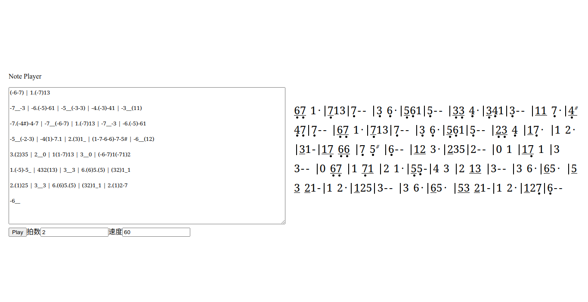

# Note Player

简单音符播放器

解析特殊格式的字符串并播放

使用 [Tone.js](https://tonejs.github.io) 合成音乐

在线体验：<https://jin-42.link/note-player>

屏幕截图：

## 符号表示

- 音符

  `1234567`

- 八度 `-+`

  `-71234567+1`

- 半音 `#bB`

  `-7b` `2#`

- 音长 `()`

  `-7(123)4((567))+1`

- 附点 `.`

  `-7..`

- 休止符 `0`

  `1230456007+1`

- 小节线 `|`

  `-7(123)4((56))|((7))+1`

- 延音线 `_`

  `-71_23`

## TODO

- 无音高音符 `xX`

  `xxXX`

- 拍号 `/`

  `2/4` `3/4` `4/4` `3` `4`

- 变调与调号 `=`

  `2 = Cm`

- 圆滑线与连结线 `~`

  `123~456~7`

- 跳音

  `^`
